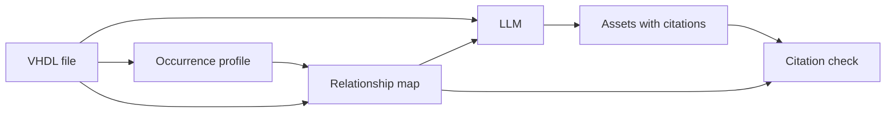

# Security assets from VHDL, with an audit trail

This work, from July to October 2026, replicates part of LAsset (arXiv:2601.02624, DATE 2026), which uses an LLM to find the security assets of RTL modules. It was replicated up to the list of primary assets (Algorithm 1, lines 3-5). Those lines are the spec summary, the list of ports and signals, and asset generation. I ran it on NEORV32, a RISC-V processor written in VHDL. The final pipeline drops the spec summary and reads only the RTL. I did not replicate the secondary assets (line 6) or the refinement stage (lines 7-9).

**[`FINAL_NOTEBOOK.ipynb`](FINAL_NOTEBOOK.ipynb)** runs the final pipeline on the 41 NEORV32 modules that have a manual reference, without an API key: occurrence profiles, the relationship map, checks of both, asset generation, the audit trail of every listed asset, and the comparison with LAsset.

## The question asked

The reference is LAsset's manual list of assets: the sheet "Assets (Manual)" in the LAsset repository ([Ajoad/LAsset-Security-Assets](https://github.com/Ajoad/LAsset-Security-Assets), `SoC/Asset_Dataset_Statistics_NEORV32.xlsx`). LAsset's authors wrote it by hand from their hardware-security knowledge and cross-checked it with LLM chatbots (paper, p.5). It covers 41 NEORV32 modules with 302 entries, as the paper counts them. Two of them are repeats (`twi_sda_i` and `twi_sda_o` each appear twice in the TWI module), so 300 are scored here. A listed element that is in the reference is a hit (a true positive); one that is not is a false positive. **Precision** is the share of listed elements that are hits; **recall** is the share of reference entries found. The prompts were developed on 15 modules (the tuning set, 111 entries), and 26 others were kept aside for testing (the held-out set, 189 entries).

The paper reports no precision or recall for its initial lists: it counts hits and false positives only after refinement. So LAsset's initial lists, published in the same repository, were scored here against the reference with the same scorer. On the 15 tuning modules, its spec+RTL list (137 elements) scores precision 0.737 and recall 0.910, and its RTL-only list scores 0.680 and 0.748. (For its final NEORV32 lists, after refinement, the paper's Table III gives recall 0.901, 272 of 302, from which precision 0.822 follows.)

The prompts (gpt-5-mini, RTL only) reached recall 0.886, close to LAsset's spec+RTL list and above its RTL-only list, but only by listing about three times as many elements: 404 per run against 137. So their precision was much lower: 0.243, against 0.737 (spec+RTL) and 0.680 (RTL-only). (Log: `logs/V02_HANDOFF.md`; LAsset's lists re-scored with `src/eval_assets.py`.)

Nath & Tan (ISQED 2025, arXiv:2502.04648) find likely primary assets in Verilog designs from patterns in the RTL. From their work came the idea that a signal's role can be read from where it appears in the code. In August this was tried with a parsed file written by an LLM, plus instructions on how to read it, and it made things worse: precision went from 0.251 to 0.240 and recall from 0.925 to 0.847 (gpt-5-mini, 15 modules, 3 runs).

So the question asked was:

> **If the LLM also gets a file that shows where each signal appears and how the signals relate to each other, will it find the true positive assets while listing fewer false positives?**

## What was built

An LLM (gpt-5-mini) could not build that file reliably. In a test on two modules, its first pass gave the right surrounding `if` / `case` structure for only 476 of 661 occurrences, and even after a second pass that checked the first, 22 were still wrong. So the file was built with code, in two parts:

- **Occurrence profile:** every place a signal's name appears, with an occurrence ID, its line, what the signal does on that line (declared, assigned, read in a condition, ...) and the surrounding context to that occurrence. What each field of an entry holds (the entries are in `final/occurrence_profiles/<module>.json`):

  ```json
  {
    "Occurrence ID": "the number of this appearance counted per signal from 1, in file order",
    "Occurrence Lines": "its line in the source file",
    "Name As Written": "the name as written on that line, with any index or slice (for example `ctrl.lock`); on a record field's first entry it names the record's declaration, as in `ctrl (declaration of the base)`",
    "Line Text": "the line, with comments removed",
    "Context": "the VHDL blocks around the occurrence, innermost first, each with its line range",
    "Path": "the conditions that must hold for this line to run, outermost first, for example `rising_edge(clk_i)`. Empty for a declaration, which is not inside any `if` or `case`.",
    "SITE Tagged": ["`DECL_PORT` (declared as a port), `LHS_PROC` (assigned inside a process), `IF_COND` (read in an `if` condition), `EDGE_CHECK` (the clock in `rising_edge(...)`), `RHS_OPERAND` (read as an operand). There are 21 tags; their rules are in `bahavioral_patterns_of_assets/annotation_pack_elements/occurrence_prompts_v3d/rulebook.json`"]
  }
  ```

- **Relationship map:** typed records between signals: one signal feeds, guards, selects, clocks or resets another. Each record is tied to the occurrence IDs where it holds.

Both are checked against the source code (notebook section 4).



Where the files are:

- occurrence profiles in `final/occurrence_profiles/`;
- relationship maps in `step1/lasset_step1/relation_map_code_tuning/b0e767000ec2_codetags/` and `.../relation_map_code_heldout/...`.

### What the LLM gets

For each module, code writes one text file (`assetgen_meta/traced_inputs_v2/<tuning or heldout>/<module>.txt`) with three parts:

1. the RTL, with comments removed and each line starting with its line number;
2. the relationship map: one line per port or signal, then its occurrences and its records;
3. a flow graph, computed by code from the records: where the value of each input goes.

The prompt (`assetgen_meta/prompt_opt/v1/exec_prompt.txt`, section 1) explains each part. For every asset, it asks the LLM to cite one of the signal's occurrence IDs and one record that holds there. If the map has no fitting record, the LLM sets the record to null and names the statement the map missed.

<details>
<summary>Example: the watchdog's lock bit, from the input file to the audit trail</summary>

Input, RTL part (`assetgen_meta/traced_inputs_v2/tuning/neorv32_wdt.txt`):

```
   93 |             if (ctrl.lock = '0') then
   94 |               ctrl.enable  <= bus_req_i.data(ctrl_enable_c);
   95 |               ctrl.lock    <= bus_req_i.data(ctrl_lock_c) and ctrl.enable;
```

Input, map part (two of its records):

```
SIGNAL {"name":"ctrl.lock","entity":"neorv32_wdt","kind":"register","handling":["ORIGINATES","CONSUMES"],"storage":"edge"}
    {"occurrences":[{"id":1,"line":54},{"id":2,"line":76},{"id":3,"line":93},{"id":4,"line":95},{"id":5,"line":110}]}
    {"type":"GATES","at":[3],"guard":"ctrl.lock = '0'","lines":[93],"targets":["ctrl.enable","ctrl.lock","ctrl.strict","ctrl.timeout"]}
    {"type":"CLOCKED_BY","at":[4],"lines":[95],"targets":["clk_i"]}
```

Section 1 of the prompt explains the whole input: 

      (b) RELATIONSHIP MAP. A static analyser (a program, not a model) wrote it from that RTL. It records how values move and are controlled. It makes no judgement about meaning, importance or security. It has two parts.

      ELEMENTS AND RECORDS. One element per line that starts with PORT or SIGNAL, followed by a JSON object:
      - "name": a declared element: a port, an internal signal, or a field of a record, written <record>.<field>. A whole record and each of its fields are separate elements: a record port has its own PORT line and so does each of its fields, and likewise for internal record signals. A whole record's own "storage" and records are not informative; its relationships sit on its fields.
      - "entity": the entity that declares the element.
      - "boundary" (ports only): "mode" is in, out or inout; for an output, "drive" is driven (assigned from elements), tied (only constants) or undriven (never assigned as a whole; its fields may be).
      - "kind" (signals only): register (assigned on a clock edge somewhere) or signal.
      - "storage": edge (every assignment is on a clock edge, so the element holds its value between edges), none (combinational), mixed (both), or not assigned (never assigned in this file: an input, an element driven only by a sub-unit, or unused).
      - "handling" (record fields): ORIGINATES (this module creates the value), CONSUMES (this module reads it), FORWARDS (this module passes it on unchanged).

      The indented lines under an element belong to it:
      - {"occurrences": [{"id": N, "line": L}, ...]}: every place the element's name appears, with its occurrence ID and RTL line. Occurrence IDs are numbered per element, starting at 1.
      - {"constant_drivers": [...]}: assignments that give the element a literal or a named constant, with their lines.
      - {"configuration": [...]}: build-time conditions (generics, constants) under which the element exists or is driven.
      - {"connections": [...]}: the element is wired to port "formal" of the instantiated sub-unit "instance"; "at" is the occurrence ID of the wiring. "mode" is that sub-unit port's direction, read from the sub-unit's own declaration: in means this element's value goes into the sub-unit; out means the sub-unit drives this element.
      - relationship records: {"type": ..., "targets": [...], "at": [occurrence IDs of THIS element where the record holds], "lines": [their RTL lines], "guard": the condition text, for control types}.


Output (gpt-5.4, run 0, `runs/assets_tuning18_m7e194es0opt1_g54_r0/_nested/neorv32_wdt.json`):

```json
{"asset rtl": "ctrl.lock", "entity": "neorv32_wdt", "realization": "stores",
 "occurrence": 4, "edge": {"type": "CLOCKED_BY", "partner": "clk_i"}}
```

(`realization` is the role the LLM gives the signal: here, that it stores a value. For `stores`, the prompt asks for the clock-edge record, so `CLOCKED_BY clk_i` is the expected citation.)

Audit trail (`final/fp_trace41/gpt54/ledger.csv`): occurrence 4 of `ctrl.lock` is line 95, and the record `CLOCKED_BY clk_i` holds there, so the citation is verified. `ctrl.lock` is in LAsset's reference, so it is a hit.

</details>

Code checks every citation: the occurrence ID must belong to that signal, the cited record must hold at that occurrence, and the record type must fit the role the LLM gives the signal. On all 41 modules, gpt-5.4's citations pass for 1,915 of its 1,953 listings over three runs (98%; an asset listed in all three runs counts three times). So the LLM can read the map: almost every citation points to a record that really holds. It does not show that the listed signal is an asset.

## Findings from trial

The answer was no. Each result is followed by the pass rule written before the run, and the log it is in.

- **20 Sep, baseline** (`ism`, gpt-5-mini, RTL only): precision 0.344, recall 0.847 on the 15 tuning modules. (Log: `logs/ABLATION_LOG_V2.md`.)
- **21 Sep, fixed rules over the map, after generation:** precision 0.344 to 0.433, recall 0.847 to 0.802. Rule: precision up by 0.10 with recall down by no more than 0.03. Not met. (Rules: `step2/RULES.md`; result re-derived later, in `docs/TIMELINE.md`.)
- **30 Sep, map in the LLM's input** (`ismc`): precision 0.346, recall 0.787. Rule: precision at least 0.374 with recall at least 0.83. Not met. (Log: `notebooks/assetgen_meta.ipynb`; `assetgen_meta/contribution_assessment/1_evidence_ledger.md`.)
- **1 Oct, filter after generation** (vote over runs, drop signals with no evidence, add back inputs), 26 held-out modules: precision +0.049 over the vote alone (95% interval 0.025 to 0.080), recall 0.884. Rule: the interval above zero and recall at least 0.83. Met. (Log: `step1/lasset_step1/RELATION_EXPERIMENTS_LOG.md`; rule in `assetgen_meta/HELDOUT_PREREG.md`.)
- **1 Oct, traced prompt** (`ist`: map in the input, a citation per asset, four questions per concept: confidentiality, integrity, availability, undermined behaviour): precision 0.359, recall 0.691. Rule: at least 80% of citations verified, and precision at least 0.374 with recall at least 0.83. Citations met (81%); precision and recall not met. The four questions did not tell concepts apart: integrity "yes" on 274 of 276, confidentiality "no" on 276 of 276. (Log: `step1/lasset_step1/RELATION_EXPERIMENTS_LOG.md`.)
- **2 Oct, `ist2`** (the four questions moved to a separate call): precision 0.343, recall 0.733, citations verified 82%. Rule: at least 90% verified, recall at least 0.817 and precision at least 0.344. Not met. (Log: `notebooks/assetgen_meta.ipynb`.)
- **2 Oct, final prompt** (`ist2` plus three edits) on gpt-5.4: precision 0.407, recall 0.820 on the tuning modules. Rule: precision up by at least 0.03 with recall down by no more than 0.03, against `ist2` on the same model. That baseline lost a run when the API credits ran out; on its 2 complete runs it also scores 0.407, so the gain over gpt-5-mini (0.343) comes from the model, not the edits. (Log: `assetgen_meta/prompt_opt/OPTIMIZATION_LOG.md`.)
- **3 Oct, the 1 Oct filter on the final gpt-5.4 runs:** held-out precision +0.011 (95% interval -0.004 to +0.029), recall down 0.037. Same rule as on 1 Oct, applied after the fact: not met, so the final pipeline does not use it. (Log: `FINAL_NOTEBOOK.ipynb`, section 6; `docs/TIMELINE.md`.)

## Next question

> **What causes the cap on how far prompting can reduce false positives?**

Many false positives behave in the code like hits do. On all 41 modules (gpt-5.4, 3 runs), by the role the LLM gives each listed signal:

| role | hits | false positives | hit share |
|---|---|---|---|
| stores (cites the clock edge) | 245 | 724 | 25% |
| computes | 86 | 306 | 22% |
| exit port | 228 | 73 | 76% |
| sets | 211 | 80 | 73% |

So a stored register that the LLM lists is a hit about 1 time in 4: the same behaviour (being stored on a clock edge) is a hit a quarter of the time and a false positive the rest. A rule against that behaviour loses hits; a rule for it adds false positives.

Two tests show this. Dropping every listing whose cited record is a clock edge (`CLOCKED_BY`; 948 of 1,953 listings) raises precision from 0.394 to 0.524 but drops recall from 0.856 to 0.586 (pooled over the three runs like the headline numbers; checked on the same runs, after seeing these counts). Rules found on the 15 tuning modules raise precision on the 26 held-out modules from 0.388 to 0.545, but recall falls from 0.877 to 0.598.

The reference itself treats the same kind of element differently across modules: for example, it lists state-machine state for the bus and the multiplier/divider but never for the cache, the debug transport module, SPI or TWI.

This is also why the citations do not help: false positives cite real code almost as often as hits do (see the audit trail under "What the work shows"). The gap is a choice among real signals, not a misreading of the code (notebook section 10).

## The final question

> **When an LLM lists a security asset in an RTL module, can that decision be checked against the code: which line, which signal, which relationship made it an asset?**

Yes, for each listing: see the citation check above. This question was first noted in September, while the prompt was being rebuilt, and set aside until that step was done.

LAsset does not answer it. Each LAsset asset comes with written fields (Fig. 5, p.5): structural name, security objective, secondary asset, linkage path, Degree of Influence, entity, functionality, attack scenario, CWEs and CWE reasoning. None of them gives a line number, and nothing checks by code that a quoted line exists or supports the claim. The paper sets out to give verifiable justifications (p.3), but it does not measure this.

What this work adds: every listed asset cites an occurrence ID and a relationship record (or names the statement the map missed), and code checks the citation. Where to find it:

- the LLM's answers: `runs/assets_tuning18_m7e194es0opt1_g54_r0/` to `_r2/` and `runs/assets_heldout26_m7e194es0opt1_g54_r0/` to `_r2/`;
- in each, `<module>.json` is the asset list and `_nested/<module>.json` is the full answer with its citations;
- the checked trail of every listed asset: `final/fp_trace41/gpt54/ledger.csv`.

## What the work shows

- **The profile and map match the source code.** Rebuilt from the raw VHDL, the 43 maps (the 41 modules plus two control modules) and the 41 LLM inputs come out the same, byte for byte, and all 17,757 occurrences sit on a line that names their signal. The relationship records match a gold sample (an answer set) at 0.988 precision and recall (95% interval 0.969 to 1.0; 212 records, tuning modules only). gpt-6-astra wrote both that sample and the code that builds the records (from separate examples), so this is a consistency check, not human ground truth.
- **Precision is far below LAsset's; recall is higher than its RTL-only list.** Final prompt on gpt-5.4, three runs, all 41 modules: precision 0.394, recall 0.856.
  - Against LAsset's RTL-only list (the fair comparison, since this pipeline reads only RTL: precision 0.711, recall 0.753), precision is lower by 0.316 and recall higher by 0.102 (95% intervals from resampling modules: 0.232 to 0.392, and 0.037 to 0.167). Against its spec+RTL list (0.735, 0.880), recall is level.
  - Held-out precision (0.388) is close to tuning precision (0.406), so tuning did not cause the gap.
  - A Claude agent (Opus 5.5) running the same prompt, as a check: precision 0.343, recall 0.932.
  - The final runs moved from gpt-5-mini to gpt-5.4 to see whether the precision ceiling came from the model's ability to reason: ten gpt-5-mini prompt versions had stayed between 0.336 and 0.360. The stronger model helped (findings, 2 Oct) but closed only part of the gap.
- **The audit trail explains why the false positives do not go down** (gpt-5.4, all 41 modules, 1,183 false-positive listings over three runs):
  - 97.1% of false positives and 99.5% of hits pass the citation check, so the false positives are not misreadings of the code.
  - All 13 relationship classes (such as "controlled by an input port") appear on both, and 23.8% of false positives have exactly the profile of some hit.
  - So a score built from these profiles separates them only partly on a module it was not trained on: AUC 0.678 on the tuning modules, 0.875 on the held-out modules (the chance that a random hit scores above a random false positive; 0.5 is chance).
  - The reference rarely lists internal state registers (stored signals that no input writes in one step and whose value never reaches an output): 15.9% of the model's list, but 8.2% of the reference on the tuning modules and 1.1% on the held-out modules.
  - 44.4% of the false positives belong only to concepts (the security functions the LLM names) for which the reference lists nothing.
- **The two structures also describe each module:** which registers an input writes (192; 116 from a write-data port), which signals guard those writes (such as `ctrl.lock`), which registers have a reset, and which values reach an output.
- **On LAsset's own list, the map is an audit trail, not a filter.** A test whose pass rule was written before the run could not tell LAsset's held-out hits from its false positives: AUC 0.639 (97.5% interval 0.495 to 0.768, which includes chance).
- **LAsset's precision comes mostly from its generation step.** Its 0.737 (spec+RTL, tuning) is before refinement, which is not replicated here; refinement raises it to 0.800 (held-out 0.734 to 0.791). Its spec adds mostly recall over RTL-only (+0.162 tuning, +0.105 held-out) and little precision (+0.057, +0.004). The August log credited refinement for its precision; that reading was wrong.

## What this does not show

- A false positive only means LAsset's reference does not list the element. It is not proof that the element is not an asset. The reference is one hand-made list, by LAsset's authors.
- The final gpt-5.4 results use only three runs per module.
- The held-out set is not fully blind. Before its runs, all 41 modules were checked to confirm that the reference lists almost no clock or reset inputs and no ports that carry a whole bus request or response as one VHDL record, and the prompt states both rules.
- The LAsset numbers come from its published lists, scored with this project's scorer; LAsset itself was not rerun.
- The models and the scorer changed over time; compare numbers within one study.

## Next steps

1. **Check the map by hand.** write the records for sampled held-out occurrences, without seeing the map. If agreement with the map is below the LLM gold sample's (the 95% intervals do not overlap), the 0.988 overstates the map. The audit trail rests on this.
2. **Use the checked map to test security properties.** The map records write guards (signals that decide whether a register can be written): in the watchdog, software can rewrite the control fields only while `ctrl.lock` is '0', and only a reset clears it. Each guard can become a check tied to a known hardware weakness (CWE) and an assertion ("once `ctrl.lock` is set, the settings hold until reset"). Bugs would be planted in simulation; a check that misses one fails.

Longer term: trace secondary assets across modules, and port the tools to Verilog.

## Credits

- **LAsset** (Hasan et al., DATE 2026): the task, the method, the reference and the comparison lists.
- **SAIF** (Farzana et al., VTS 2021): the primary/secondary split. It was tested as a prompt variant in August: precision rose, but recall fell from 0.925 to 0.628 (gpt-5-mini, tuning modules), so it was rejected.
- **IEEE P3164 white paper** (2024): the method the prompt follows: conceptual assets first, then their RTL elements.
- **Nath & Tan** (ISQED 2025): the idea of reading a signal's role from where it appears in the code (see the top). The August instructions for the LLM parser (commit `9dc383d`) took four readings from them: the side of an assignment, links through instantiation, width as a weak hint, and their worked example.

## Timeline

[`docs/TIMELINE.md`](docs/TIMELINE.md) has the full story and every number's source.

| when | what | where |
| --- | --- | --- |
| July | LAsset replication; ports and signals listed by code; first run's false positives | `notebooks/finetuning_assetgen.ipynb` |
| 2-8 Aug | first prompt study: raise recall | `logs/ABLATION_LOG.md` |
| 8-18 Aug | second prompt study: raise precision, keep recall | `logs/ABLATION_LOG_V2.md` |
| 17 Aug - 6 Sep | LLM parser and its checker; relationship types defined | `bahavioral_patterns_of_assets/PARSER_ABLATION_LOG.md` |
| 9-29 Sep | occurrence profiles: LLM versions, then code | `bahavioral_patterns_of_assets/notebooks/occurrence_profiles_v3b.ipynb` |
| 19-30 Sep | rebuilt prompt; relationship map built by code, tried in the prompt | `notebooks/assetgen_meta.ipynb`, `step1/lasset_step1/RELATION_EXPERIMENTS_LOG.md` |
| 1-2 Oct | held-out pass rules written before the runs, traced prompts, prompt-optimization loop (Claude agents revised the prompt on the tuning modules), the map on LAsset's lists | `assetgen_meta/HELDOUT_PREREG.md` |
| 2-3 Oct | final prompt on gpt-5.4 for all 41 modules, false-positive trace, 1 Oct filter re-checked | `FINAL_NOTEBOOK.ipynb` |

Key decisions:

- Pass rules written before each run, from the first study on. Wrong predictions were kept, and corrections were written beside the registered text, never inside it.
- No answers in prompts. A leaked reference name was removed, and code now enforces the rule.
- Code where there is one right answer. Structure and relationships moved from the LLM to code after its errors were measured.
- No prompt rules fitted to the reference alone; such rules run as code after generation and are reported separately. One that failed on the held-out modules was rejected.
- Earlier wrong claims were corrected in the logs.

## Repository map

| path | what it holds |
| --- | --- |
| `FINAL_NOTEBOOK.ipynb` | the final pipeline, its checks and results (start here) |
| `final/` | the notebook's helper code, scoring and false-positive scripts, occurrence profiles |
| `runs/` | the saved LLM answers, for re-scoring without an API key |
| `data/` | NEORV32 VHDL, LAsset's reference and lists, closed sets (each module's ports and signals, by regex) |
| `step1/` | code that builds the profiles and maps, the stored maps, the gold sample |
| `assetgen_meta/` | prompts, traced inputs, the citation checker, pre-registrations |
| `notebooks/` | earlier study notebooks |
| `logs/` | logs of the August prompt studies |
| `docs/` | the full timeline (`TIMELINE.md`) and folder layout (`LAYOUT.md`) |
| `src/` | earlier study code: parser, scorer (`eval_assets.py`), the check that pre-registered files are unchanged |
| `step2/` | the fixed rules over the map (21 Sep), the held-out closed-set builder |
| `bahavioral_patterns_of_assets/` | parser and checker logs, occurrence-profile notebooks and prompts |
| `blind_agent/` | side study: prompts written from theory only |
| `third_party/` | the NEORV32 license |

Logs and outputs written before 2 Oct 2026 use the old root paths (for example `RTL_data/` for `data/RTL_data/`). [`docs/LAYOUT.md`](docs/LAYOUT.md) maps them.

## Running it

```bash
pip install -r requirements.txt
```

Open `FINAL_NOTEBOOK.ipynb` and run all cells. It needs no API key: the gpt-5.4 answers it scores are already in `runs/`. If the VHDL grammar for tree-sitter (a parser library) is missing, the first code cell stops and gives the one-line command that fetches it.

To generate missing held-out gpt-5.4 runs, put `OPENAI_API_KEY=...` in a file named `API.env` in the repo root and set `RUN_API = True` in the first code cell. Modules already on disk are skipped. Git ignores `API.env`, so the key is never committed.

Some paths are long. On Windows, clone into a short folder or run `git config --global core.longpaths true`.

`FINAL_NOTEBOOK.ipynb` and `notebooks/lasset_evidence_layer.ipynb` re-run in full on a fresh clone. The other notebooks are records of earlier runs; some files they read are not published. [`docs/LAYOUT.md`](docs/LAYOUT.md) explains how to run their code in the old layout, and how to check that the files named in the pre-registrations are unchanged: `python src/verify_layout_move.py`.

## Third-party material

The NEORV32 RTL (BSD 3-Clause), LAsset's reference lists (no upstream license; included for scoring, with
attribution) and two open IPs used as worked examples in prompts are described in
[`THIRD_PARTY_NOTICES.md`](THIRD_PARTY_NOTICES.md).
